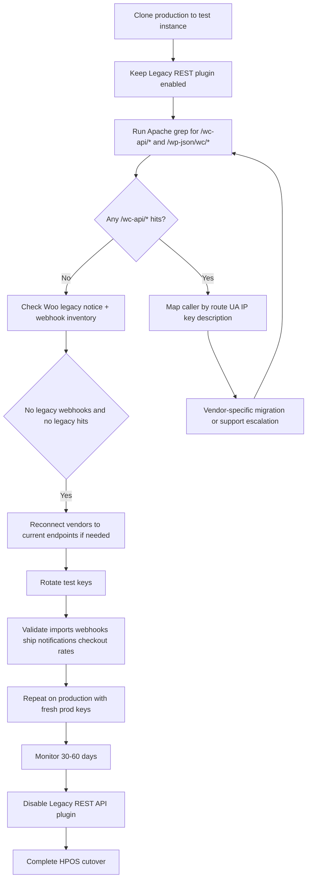

# WooCommerce Legacy REST Endpoint Audit for Bitnami Lightsail

## Executive summary

You can identify WooCommerce **legacy REST** traffic by one thing above all others: the URL family. The **old legacy API** uses paths like `/wc-api/v1`, `/wc-api/v2`, and `/wc-api/v3`. The **current recommended WooCommerce REST API** uses `/wp-json/wc/v3`. WooCommerce’s own current docs explicitly recommend `/wp-json/wc/v3` for new integrations, while the older docs describe `/wc-api/v3` as the legacy family that predated the WordPress REST API integration. citeturn1view0turn0search1turn1view1turn26search3

The most important operational point for your store is this: **API keys alone do not tell you whether a service is using legacy or current endpoints**. WooCommerce itself says the REST API key list can offer hints based on descriptions, but it is not enough to determine whether a client is using legacy routes or only current ones. WooCommerce 8.5+ added **legacy-usage detection** and logs that include the **route** and a **user-agent clue**, which is the most reliable in-product signal short of access logs. citeturn4view0turn5view2

Because **production access logs were not uploaded in this conversation**, I cannot complete endpoint attribution conclusively. What I *can* do is give you a high-confidence detection and migration framework, plus a likelihood map for each integration based on official documentation and the connected GitHub repo review. Without logs, the integration mapping below is **probabilistic**, not final. citeturn4view0turn20view0

On the integrations you named, the strongest findings are these. **ShipStation** current releases are documented around a custom REST namespace and current plugin flows, not `/wc-api/*`; if you still see ShipStation hitting `/wc-api/*`, that strongly suggests an old plugin or old connection path. **Klaviyo** explicitly documents that some older WooCommerce setups used the **Legacy API** and that current migration requires a **v3 REST API key**. **Chit Chats** documents the standard WooCommerce **REST API key** flow, which points toward the current REST stack, but its public docs do not disclose the exact namespace, so logs are still needed. **Machool** public docs are insufficient to determine whether its store-sync path is `/wc-api/*` or `/wp-json/wc/*`; your existing Woo key labeled “Machool - API” is evidence that *something* in that stack likely authenticates to Woo, but not which endpoint family it uses. citeturn8search0turn13view0turn8search1turn8search5turn10search0turn14view0turn16search1

The connected GitHub repo **Affinity-Design/woonuxt** is **GraphQL-first**, not legacy-REST-first: its README says the project uses **WPGraphQL** to retrieve store data, and its environment example makes `GQL_HOST` the required WordPress/WooCommerce connection variable. That same env file also includes `WC_CONSUMER_KEY` and `WC_CONSUMER_SECRET`, which means the app may still perform authenticated WooCommerce API operations somewhere, but the repo’s stated architecture does **not** point to the old `/wc-api/*` family as its main data plane. fileciteturn8file0L3-L3 fileciteturn10file0L3-L3

One more architectural point matters for your HPOS goal: WooCommerce warns that the **Legacy REST API plugin is not compatible with HPOS** unless you keep **Compatibility Mode** on during transition. So if any integration is still hitting `/wc-api/*`, it is not just a nuisance; it is a direct blocker to a clean HPOS posture. citeturn4view0turn5view3

## What legacy endpoints look like and how they differ

The cleanest way to define the families is:

| Family | What it looks like | Status |
|---|---|---|
| Legacy WooCommerce REST API | `/wc-api/v1`, `/wc-api/v2`, `/wc-api/v3` | Deprecated legacy family from before WooCommerce moved onto the WordPress REST API. citeturn0search1turn1view1 |
| Current WooCommerce REST API | `/wp-json/wc/v3` | Current and recommended for new integrations. citeturn1view0turn26search3 |
| Older WP REST versions | `/wp-json/wc/v1`, `/wp-json/wc/v2` | Not the old `/wc-api/*` family, but still older than current v3. Woo labels them as older API versions and recommends v3 for new work. citeturn26search1turn26search2turn26search3 |
| Store API | `/wp-json/wc/store/v1` | Public customer-facing cart/checkout/product API; not the admin/integration API you are auditing here. citeturn21search3turn21search4 |

The old legacy docs show the classic legacy pattern very clearly:

```bash
GET https://example.com/wc-api/v3/orders
POST https://example.com/wc-api/v3/orders
```

and the legacy request/response shapes use wrappers like:

```json
{ "order": { ... } }
```

for creates, and

```json
{ "orders": [ ... ] }
```

for lists. They also use field names such as `billing_address`, `shipping_address`, `payment_details`, and `note`. citeturn25search1

By contrast, the current v3 API is rooted under:

```bash
GET https://example.com/wp-json/wc/v3/orders
```

and the current schema exposes order properties directly with field names such as `billing`, `shipping`, `payment_method`, `payment_method_title`, `transaction_id`, `customer_note`, and `meta_data`. Current collection endpoints also use standard WP REST pagination behavior and headers such as `X-WP-Total`, `X-WP-TotalPages`, and `Link`. citeturn21search0turn30view0turn31view1turn31view2turn2view0

That leads to the most practical comparison for your audit:

| Aspect | Legacy `/wc-api/v3` | Current `/wp-json/wc/v3` |
|---|---|---|
| Base path | `/wc-api/v3/...` citeturn1view1 | `/wp-json/wc/v3/...` citeturn1view0turn21search0 |
| Payload wrapper | Often wraps in `order` / `orders` objects. citeturn25search1 | Resource schema is direct WP REST style; order fields are first-class properties like `billing`, `shipping`, `payment_method`. citeturn30view0turn31view1turn31view3 |
| Address fields | `billing_address`, `shipping_address` citeturn25search1 | `billing`, `shipping` citeturn30view0turn31view1 |
| Payment fields | `payment_details` citeturn25search1 | `payment_method`, `payment_method_title`, `transaction_id` citeturn30view0turn31view3 |
| Note field | `note` citeturn25search1 | `customer_note` citeturn31view1 |
| Meta field | `meta` on items in legacy docs citeturn25search1 | `meta_data` in current schema citeturn31view2 |
| Pagination | Legacy docs show classic non-header wrapper responses. citeturn25search1 | WP REST pagination via headers like `X-WP-Total` and `Link`. citeturn2view0 |

Illustrative cURL comparison:

```bash
# Legacy family
curl -u ck_REDACTED:cs_REDACTED \
  "https://store.example.com/wc-api/v3/orders"
```

```bash
# Current recommended family
curl -u ck_REDACTED:cs_REDACTED \
  "https://store.example.com/wp-json/wc/v3/orders?per_page=10&page=1"
```

```bash
# Legacy create shape
curl -X POST -u ck_REDACTED:cs_REDACTED \
  "https://store.example.com/wc-api/v3/orders" \
  -H "Content-Type: application/json" \
  -d '{
    "order": {
      "payment_details": {
        "method_id": "bacs",
        "method_title": "Direct Bank Transfer",
        "paid": true
      },
      "billing_address": {
        "first_name": "John",
        "last_name": "Doe"
      },
      "shipping_address": {
        "first_name": "John",
        "last_name": "Doe"
      },
      "line_items": [
        { "product_id": 546, "quantity": 2 }
      ]
    }
  }'
```

```bash
# Current v3 create shape
curl -X POST -u ck_REDACTED:cs_REDACTED \
  "https://store.example.com/wp-json/wc/v3/orders" \
  -H "Content-Type: application/json" \
  -d '{
    "payment_method": "bacs",
    "payment_method_title": "Direct Bank Transfer",
    "set_paid": true,
    "billing": {
      "first_name": "John",
      "last_name": "Doe"
    },
    "shipping": {
      "first_name": "John",
      "last_name": "Doe"
    },
    "line_items": [
      { "product_id": 546, "quantity": 2 }
    ]
  }'
```

Use **Basic Auth over HTTPS** whenever possible. WooCommerce documents query-string credential fallbacks for both old and current APIs when servers mishandle headers, but that is exactly why your log grep commands below explicitly redact `consumer_key` and `consumer_secret`: query-string auth can leak secrets into access logs. citeturn1view1turn2view2

## How to detect legacy hits on Bitnami and with WP-CLI

Bitnami documents the Apache log locations you care about on WordPress stacks as:

- `/opt/bitnami/apache/logs/access_log`
- `/opt/bitnami/apache/logs/error_log` citeturn20view0

WooCommerce also says its own logger is viewable at **WooCommerce → Status → Logs**, and that logs may be stored either in the filesystem or the database depending on configuration. Webhook deliveries are also logged there. citeturn23view0turn24view0turn24view2

### Bitnami Apache commands

These commands are designed to be **safe to paste**, **credential-redacting**, and useful on a Bitnami Lightsail instance.

Use this first to find **legacy-only** traffic:

```bash
sudo bash -lc '
(
  grep  -hE "\"(GET|POST|PUT|PATCH|DELETE) /wc-api/v(1|2|3)/" /opt/bitnami/apache/logs/access_log* 2>/dev/null
  zgrep -hE "\"(GET|POST|PUT|PATCH|DELETE) /wc-api/v(1|2|3)/" /opt/bitnami/apache/logs/access_log*.gz 2>/dev/null
) \
| sed -E "s/(consumer_(key|secret)=)[^&\" ]+/\1REDACTED/g" \
| sed -E "s/(oauth_consumer_key=)[^&\" ]+/\1REDACTED/g"
'
```

Use this to compare **legacy vs current vs ShipStation custom REST** in one pass:

```bash
sudo bash -lc '
(
  grep  -hE "/(wc-api/v(1|2|3)|wp-json/wc/v(1|2|3)|wp-json/wc-shipstation|wc-shipstation/v1)" /opt/bitnami/apache/logs/access_log* 2>/dev/null
  zgrep -hE "/(wc-api/v(1|2|3)|wp-json/wc/v(1|2|3)|wp-json/wc-shipstation|wc-shipstation/v1)" /opt/bitnami/apache/logs/access_log*.gz 2>/dev/null
) \
| sed -E "s/(consumer_(key|secret)=)[^&\" ]+/\1REDACTED/g" \
| awk -F\" '\''{
    split($2, r, " ");
    ip=$1; sub(/ .*/, "", ip);
    ua=$6;
    printf("%s\t%s\t%s\t%s\t%s\n", ip, r[1], r[2], $3, ua);
  }'\'' \
| sort | uniq -c | sort -nr
'
```

Use this to isolate likely **Chit Chats** calls by their officially published IPs:

```bash
sudo bash -lc '
(
  grep  -hE "35\.83\.9\.89|34\.213\.197\.31|52\.41\.193\.28|2600:1f13:518:2900::" /opt/bitnami/apache/logs/access_log* 2>/dev/null
  zgrep -hE "35\.83\.9\.89|34\.213\.197\.31|52\.41\.193\.28|2600:1f13:518:2900::" /opt/bitnami/apache/logs/access_log*.gz 2>/dev/null
) \
| sed -E "s/(consumer_(key|secret)=)[^&\" ]+/\1REDACTED/g"
'
```

Use this to get the **top legacy callers by user agent**:

```bash
sudo bash -lc '
(
  grep  -hE "\"(GET|POST|PUT|PATCH|DELETE) /wc-api/v(1|2|3)/" /opt/bitnami/apache/logs/access_log* 2>/dev/null
  zgrep -hE "\"(GET|POST|PUT|PATCH|DELETE) /wc-api/v(1|2|3)/" /opt/bitnami/apache/logs/access_log*.gz 2>/dev/null
) \
| awk -F\" "{print \$6}" \
| sort | uniq -c | sort -nr
'
```

Illustrative parsable output shape for the compare command above:

```text
42      34.213.197.31   GET   /wp-json/wc/v3/orders?status=processing   200   ExampleUA/1.0
17      198.51.100.10   GET   /wc-api/v3/orders/count                   200   legacy-client/2.4
11      203.0.113.20    POST  /wp-json/wc-shipstation/v1/shipnotify     200   ShipStation/5.x
```

The redaction is not optional. WooCommerce documents query-string credential fallback for broken Authorization-header handling, so if any client is authenticating that way, your raw access logs can contain secrets. citeturn1view1turn2view2

### WP-CLI commands

WP-CLI officially supports the commands that matter here: `wp db query`, `wp db search`, `wp plugin list`, `wp option get`, and `wp eval`. citeturn19view0turn19view2turn19view4turn19view5turn19view6

Inventory active plugins and drop-ins first:

```bash
wp plugin list --status=active --format=json
wp plugin list --status=dropin --format=json
```

Check for legacy route strings stored anywhere in the DB:

```bash
wp db search '/wc-api/' --all-tables-with-prefix --table_column_once --one_line
wp db search 'Legacy API v3' --all-tables-with-prefix --table_column_once --one_line
wp db search 'wp-json/wc/v3' --all-tables-with-prefix --table_column_once --one_line
wp db search 'wc-shipstation' --all-tables-with-prefix --table_column_once --one_line
```

Inspect WooCommerce API key inventory without exposing secrets:

```bash
wp db query "
SELECT key_id, user_id, description, permissions, truncated_key, last_access
FROM $(wp db prefix)woocommerce_api_keys
ORDER BY COALESCE(last_access, '1970-01-01 00:00:00') DESC;
" --skip-column-names
```

Find likely webhook configuration references:

```bash
wp db search 'shop_webhook' --all-tables-with-prefix --table_column_once --one_line
wp db search 'webhooks-delivery' --all-tables-with-prefix --table_column_once --one_line
```

If WooCommerce loads cleanly under WP-CLI, this is a useful webhook inventory command:

```bash
wp eval '
if ( function_exists( "wc_get_webhooks" ) ) {
    foreach ( wc_get_webhooks() as $w ) {
        printf(
            "%d\t%s\t%s\t%s\t%s\n",
            $w->get_id(),
            $w->get_name(),
            $w->get_status(),
            $w->get_api_version(),
            $w->get_delivery_url()
        );
    }
}
'
```

Illustrative parsable output shapes:

```text
# wp db search '/wc-api/' ...
wp_options:option_value:982:...https://store.example.com/wc-api/v3/orders...
wp_postmeta:meta_value:4412:...Legacy API v3 (deprecated)...

# wp db query on woocommerce_api_keys
12      1       ShipStation Integration      read_write     f65b392       2026-05-07 03:36:00
27      3       Klaviyo - API (2022-10-28)   read_write     5600126       2025-09-19 09:33:00
```

WP-CLI is great for **inventorying configuration and references**, but it does **not** replace access logs for live endpoint attribution. Apache access logs and Woo’s legacy-usage detection are the decisive sources for “who is hitting `/wc-api/*` right now?” citeturn4view0turn20view0turn23view0

## Integration-by-integration assessment

Because production logs are not in hand, the table below is a **likelihood map**, not a final verdict.

| Integration | Likely endpoint family | Why this is the current best read | What to look for in logs | Confidence |
|---|---|---|---|---|
| **ShipStation Integration / ShipStation New** | **Current custom REST**, not old `/wc-api/*`, if you are on the current plugin. Official ShipStation docs require current plugin versions and tell you to whitelist `/wp-json/wc-shipstation/*`. The official WordPress.org plugin changelog says the current plugin uses the `/wc-shipstation/v1/*` REST namespace and WooCommerce Basic Auth against `woocommerce_api_keys`. citeturn8search0turn13view0 | Requests to `/wp-json/wc-shipstation/*` or `/wc-shipstation/v1/*`; possibly ship-notify callbacks. If you see **ShipStation on `/wc-api/*`**, treat that as an old plugin, old store connection, or non-current transport path. | **High** |
| **Chit Chats** | **Probably current REST**, but logs are required to prove namespace. Official docs tell you to create a key under **WooCommerce → Settings → Advanced → REST API**, use **Read/Write**, and supply store URL. They also publish allowlist IPs for Cloudflare-blocked imports. Public docs do **not** disclose the exact Woo endpoint family used. citeturn10search0 | Chit Chats IPs `35.83.9.89`, `34.213.197.31`, `52.41.193.28`, `2600:1f13:518:2900::/56`; routes likely under `/wp-json/wc/v3/*` or possibly `/wp-json/wc/v2/*`. If any of those IPs hit `/wc-api/*`, you have confirmed legacy use. | **Medium** |
| **Klaviyo** | **Can be legacy if old setup; target should now be current `/wp-json/wc/v3`**. Klaviyo explicitly documents an upgrade path “if I integrated using the Legacy API” and says the fix is to install the latest extension and create a **REST API key for the v3 integration** with read/write permissions. They also recommend upgrading old plugin versions immediately. citeturn8search1turn8search2turn8search5 | Old/stale Klaviyo key descriptions, current Klaviyo plugin activity, and any `/wc-api/*` hits associated with Klaviyo processes. A clean modern setup should move to current v3. | **High** |
| **Machool - API** | **Unknown from public docs.** Machool publicly documents WooCommerce store syncing and a WooCommerce shipping plugin that uses a generated API key in Woo shipping settings, but the docs I reviewed do **not** reveal whether order sync uses `/wc-api/*`, `/wp-json/wc/v3`, a custom route, or another mechanism. citeturn14view0turn16search1 | Any requests tied to the “Machool - API” Woo key; any Machool plugin traffic; any custom route hits. Because public docs are incomplete here, access logs are mandatory before classification. | **Low** |
| **proskatersplace.ca / your own custom app** | **Likely not legacy for storefront reads.** The connected `Affinity-Design/woonuxt` repo is described as a modern WooCommerce front end built on **WPGraphQL**, with `GQL_HOST` as the required connection variable. The env file also includes optional `WC_CONSUMER_KEY` and `WC_CONSUMER_SECRET`, so authenticated Woo API operations may still exist somewhere, but the repo’s stated architecture is not legacy-REST-first. fileciteturn8file0L3-L3 fileciteturn10file0L3-L3 | Requests coming from your app server/NAT IPs; look for `/graphql`, `/wp-json/wc/v3/*`, and any surprise `/wc-api/*`. Search your app repo, server env, and deployment logs for `/wc-api/`. | **Medium** |
| **Legacy REST API plugin** | If active *and* receiving traffic, it is preserving old `/wc-api/*` clients. WooCommerce says current products still depending on legacy need the dedicated plugin, but it also says the plugin is not compatible with HPOS unless you use Compatibility Mode. citeturn4view0turn5view3 | Woo admin notice for legacy access, Woo legacy usage logs, and `/wc-api/*` access-log hits. | **High** |

A few practical observations from **your screenshot inventory** are worth flagging separately:

- **`ShipStation New` shows “Unknown” last access**. That is an orphan-key candidate until proven otherwise.
- **`Klaviyo - API (2022-10-28...)` shows a very old last access**. That often means either a stale integration or a historic key left behind after a migration.
- A descriptive key like **`Machool - API`** is useful, but still not enough to tell whether it is using `/wc-api/*` or `/wp-json/wc/*`.

Those are precisely the kinds of keys I would validate on the clone and then either **rotate and rebind** or **revoke** after the monitoring window.

## Migration checklist and integration playbooks

The right sequence is:

1. **Do not disable the Legacy REST API plugin first.** First prove what is using it. WooCommerce’s own guidance is to use the legacy access detection and the logs to discover route and user-agent clues before making changes. citeturn4view0  
2. **Audit access logs and Woo logs on the clone or production copy.** The decisive question is not “which keys exist?” but “which requests are actually reaching `/wc-api/*`?” citeturn4view0turn20view0turn23view0  
3. **Check legacy webhooks.** WooCommerce says legacy webhooks are visible from WooCommerce 8.3 onward, and older versions require inspecting each webhook for the “Legacy API v3 (deprecated)” setting. citeturn5view0turn5view1  
4. **Upgrade or reconnect the integrations with the strongest published migration guidance first**—that means **Klaviyo** and **ShipStation** before you spend time guessing at Machool. citeturn8search0turn8search1  
5. **Rotate keys when you cut over**, not during the first discovery pass. This avoids breaking a still-unknown dependency while you are still hunting.  
6. **Monitor long enough to catch infrequent jobs** before removing the legacy plugin and turning HPOS into the clean primary path. Woo’s log retention is configurable, which makes it practical to preserve a long enough evidence window. citeturn23view0

A clone-first migration flow for this specific store:



The integration-specific playbooks:

**ShipStation**

Current official docs say merchants affected by the 2026 migration need the latest ShipStation WooCommerce plugin and valid WooCommerce REST credentials, and they specifically call out `/wp-json/wc-shipstation/*` for allowlisting. The current WordPress.org changelog also shows the plugin’s own REST namespace under `/wc-shipstation/v1/*`. So on the clone, update ShipStation first, reconnect the store, test an order import, then test a ship/notify callback that updates the Woo order. If the clone still shows `/wc-api/*` for ShipStation traffic, stop and treat that as an old code path that must be upgraded or replaced before HPOS cleanup. citeturn8search0turn13view0

**Chit Chats**

Chit Chats’ current docs tell you to create a WooCommerce **REST API** key with **Read/Write**, supply the store URL, and allowlist their published IPs if Cloudflare or another security layer is blocking imports. On the clone, create a fresh test key, reconnect Chit Chats, import at least one order, and inspect logs. If imports work and all requests land under `/wp-json/wc/*`, you are clean. If you catch Chit Chats hitting `/wc-api/*`, open a support ticket with Chit Chats and do **not** remove the legacy plugin yet. citeturn10search0

**Klaviyo**

Klaviyo is the clearest migration candidate. Their docs explicitly say that if a store was integrated using the **Legacy API**, the path forward is to install the latest WooCommerce extension, create a **v3 REST API key** with read/write permissions, and save settings to upgrade the integration to the real-time flow. They also warn that old plugin versions should be upgraded immediately. On the clone, this is a straight reconnect-and-verify exercise: update plugin, create fresh test key, save settings, fire a test checkout and a test browse event, then verify real-time sync in Klaviyo. citeturn8search1turn8search2turn8search5

**Machool**

Machool needs evidence before you act. Their public WooCommerce docs explain both store syncing and the separate WooCommerce shipping-rate plugin, but the docs I reviewed do not identify the actual Woo endpoint family used for store sync. On the clone, separate the two functions: first test **Machool order sync**; then separately test **Machool checkout shipping rates**. If Machool needs a Woo API key for store sync, create a fresh test key and watch Apache logs during a manual sync. If the path is `/wp-json/wc/v3/*`, good. If the path is `/wc-api/*`, you have a vendor support issue to resolve before disabling legacy. If no hits appear but the sync works, the integration may be using another custom path or plugin transport. citeturn14view0turn16search1

**Your custom app / WooNuxt**

Because the connected repo is GraphQL-led, your own front end is less likely to be the blocker, but still audit it. Search your app code and environment for `WC_CONSUMER_KEY`, `WC_CONSUMER_SECRET`, `/wc-api/`, `/wp-json/wc/`, and `/graphql`. On the clone, point the app to a fresh test key set, then trigger whatever authenticated operations the app actually performs. If you never see `/wc-api/*` in logs, your custom stack is probably not the remaining legacy dependency. fileciteturn8file0L3-L3 fileciteturn10file0L3-L3

**Legacy webhooks**

If any webhook is marked **“Legacy API v3 (deprecated)”**, recreate or edit it to use the current API version before turning legacy off. WooCommerce documents both the legacy-webhook flagging and the webhook delivery logs under **WooCommerce → Status → Logs**. citeturn5view0turn5view1turn24view0turn24view2

## Monitoring plan and confidence window before disabling legacy

WooCommerce says you can view logs in **WooCommerce → Status → Logs**, filter by source, and search across log contents. It also documents that the logger has a configurable **retention period**, and that logs may be stored in files or in the database. That matters because the confidence window is only as good as the period you actually retain. citeturn23view0

My recommendation is:

- **Minimum confidence window:** **30 days**
- **Better if you have low-frequency jobs or monthly syncs:** **45 to 60 days**

That duration is a recommendation, not a published Woo rule. The reasoning is straightforward: some integrations only fire on fulfillment, subscription renewal, catalog jobs, or support workflows, so a 7-day quiet period is often not enough to prove absence.

A practical monitoring stack for your site:

**Apache access-log watch**

Keep the grep jobs above and run them daily via cron, writing sanitized TSV summaries to a file. Bitnami’s access log is the source of truth for actual route hits. citeturn20view0

**WooCommerce logger watch**

Use Woo’s built-in log UI for:
- legacy REST usage detection entries,
- webhook delivery failures,
- plugin-specific logger output. citeturn4view0turn24view0turn24view2turn23view0

**Temporary mu-plugin route logger**

If you want a high-signal audit trail for 30 to 60 days, drop in a temporary must-use plugin like this:

```php
<?php
/**
 * Plugin Name: WC API Audit Logger
 */
add_action('parse_request', function () {
    $uri = $_SERVER['REQUEST_URI'] ?? '';
    if (!preg_match('#/(wc-api/v[123]|wp-json/wc/v[123]|wp-json/wc-shipstation|wc-shipstation/v1)#', $uri)) {
        return;
    }

    $safe_uri = preg_replace(
        '#([?&](consumer_key|consumer_secret|oauth_consumer_key)=)[^&]+#',
        '$1REDACTED',
        $uri
    );

    if (function_exists('wc_get_logger')) {
        wc_get_logger()->info('API audit hit', [
            'source'     => 'api-audit',
            'route'      => $safe_uri,
            'user_agent' => $_SERVER['HTTP_USER_AGENT'] ?? '',
            'ip'         => $_SERVER['REMOTE_ADDR'] ?? '',
            'method'     => $_SERVER['REQUEST_METHOD'] ?? '',
        ]);
    }
});
```

Use that only as a temporary probe. Woo recommends using the logger with a `source` so entries are filterable, which is exactly what this snippet does. citeturn23view0

**Stale-key remediation**

From your screenshot, the most obvious cleanup candidates are:
- keys with **“Unknown”** last access,
- keys with **very old** last access,
- duplicate service keys such as “ShipStation Integration” and “ShipStation New.”

The clean pattern is:
1. verify on clone,
2. create fresh **test** keys,
3. reconnect the service,
4. verify logs and behavior,
5. create fresh **production** keys at cutover,
6. revoke the old key after the monitor window.

That will leave you with one purpose-built key per integration and much clearer attribution next time.

## Open questions and limitations

This report can tell you **how** to find the legacy callers and which integrations are **most likely** to be involved, but it cannot yet tell you **which specific service is definitively hitting `/wc-api/*` on your production store right now**, because the **production logs were not uploaded**. WooCommerce itself is clear that API keys alone do not prove endpoint family, and Machool’s public docs in particular do not disclose enough detail to classify it without live evidence. citeturn4view0turn14view0turn16search1

The unresolved items are:

- **Machool**: endpoint family unknown without logs.
- **Chit Chats**: public docs indicate current REST-key workflow, but not the exact namespace.
- **ShipStation**: current plugin evidence points away from `/wc-api/*`, but older plugin versions and old connections can still complicate attribution.
- **Your custom app**: the connected repo is GraphQL-first, but only a code-path search plus runtime logs can rule out a hidden `/wc-api/*` caller.

If you upload the Apache access logs or sanitized grep results, this can be narrowed from a likelihood model to a **definitive caller map**.