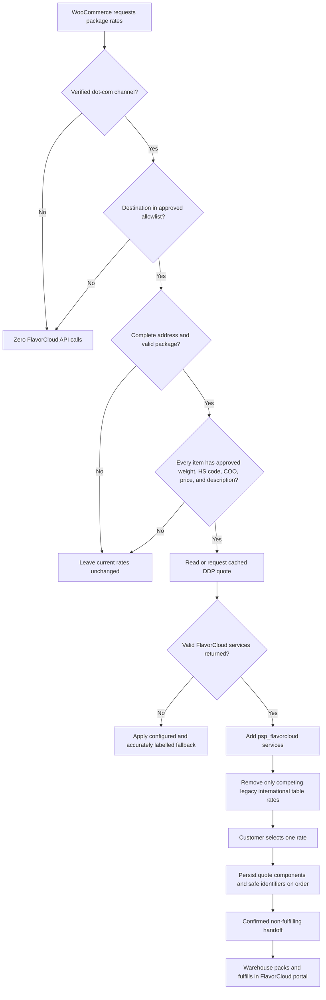

# FlavorCloud WooCommerce Plugin Research and Build Plan

Status: Research and read-only production audit complete for implementation planning on 2026-08-27; vendor-contract, credential, and catalog-wide customs-data gates remain open

Target: `proskatersplace.com` WordPress and WooCommerce storefront

Out of scope for this phase: writing the production plugin, creating labels, changing live shipping zones, or modifying the Canadian WooNuxt checkout

## Executive Decision

Build FlavorCloud as a standalone, project-owned WooCommerce plugin with its own shipping method ID, tentatively `psp_flavorcloud`. Do not add FlavorCloud logic to the theme, do not fork or impersonate WooCommerce Table Rate Shipping, and do not trigger it from every order that enters `processing`.

FlavorCloud currently lists Shopify and BigCommerce as native connectors; WooCommerce is handled through the REST API path for other platforms. The proposed plugin is therefore an API integration owned by ProSkaters Place, not a wrapper around a supported FlavorCloud WooCommerce extension.

The first production release should provide `.com` international DDP quotes for approved rest-of-world markets excluding US/CA, preserve the selected quote on the order, and support a controlled manual fulfillment handoff. Automated order push must wait until FlavorCloud provides a documented non-fulfilling order-ingestion contract.

The public FlavorCloud API has a critical mismatch with the operational workflow described on the technical call:

- FlavorCloud's public `POST /Shipments` endpoint creates labels, customs documents, and tracking. Its documentation describes the call as billable.
- The technical call described pushing a paid order into the portal first, then letting the warehouse pack it and click **Fulfill** later.
- No public `/Orders` or draft-order endpoint exists in the current OpenAPI specification.
- Manual CSV import is the only public candidate found for a portal handoff that does not call `/Shipments`, but the documentation does not define the result of leaving its rate/fulfill flags false or how the checkout quote hashes survive import.

Therefore, the plugin must not call `POST /Shipments` when an order changes to `processing` until FlavorCloud resolves the contract and billing questions in this document.

The second major constraint is storefront isolation. `proskatersplace.com` and `proskatersplace.ca` share WooCommerce infrastructure. Destination country alone cannot separate the storefronts, and the production backend's base location is Ontario even though the `.com` storefront operates in USD. Eligibility must combine a positively identified storefront channel with an approved destination allowlist:

> positively identified `.com` storefront AND approved international destination AND not a WooNuxt/`.ca` request or order

The United States and Canada are both excluded from version 1. FlavorCloud's email described the proposal as Canada-origin rates to the rest of world and requested historical international shipment data excluding US/CA. This matches the requirement to leave existing US and Canadian rates intact and prevents `.ca` leakage. Any later inclusion of either country is a new scoped decision, not a settings toggle assumed by this plan.

## Recommended Scope

### Version 1

- A dedicated `.com` international WooCommerce shipping method.
- FlavorCloud authentication and DDP rate retrieval.
- Standard and Express services when returned for the merchant account.
- HS code and manufacturing Country of Origin fields at product and variation level.
- A catalog-readiness report and CSV-compatible product-data workflow.
- Short-lived quote caching and duplicate-request protection.
- Safe coexistence with Table Rate Shipping, PSP Dynamic Table Rates, Price Based on Country, POS shipping, Code Snippets, ShipStation, and the `.ca` WooNuxt flow.
- Persistence of the selected provider quote and landed-cost components on the Woo order.
- A FlavorCloud-confirmed non-fulfilling handoff; manual CSV export is a candidate pending quote-preservation testing.
- HPOS support and the live classic shortcode checkout.
- Store API safeguards for `.ca`; customer-facing Checkout Blocks support is deferred unless the checkout page is migrated later.

### Deferred Until FlavorCloud Confirms the Contract

- Automated portal-order creation on `processing`.
- `POST /Shipments` label generation.
- Automated commercial invoice generation.
- Automatic tracking import, order completion, or customer notification.
- Webhooks, unless FlavorCloud documents authenticity and replay protection.
- DDU rates.
- Synchronous HS classification during checkout.

## Evidence and Confidence

This plan separates confirmed evidence from vendor statements and unresolved assumptions.

| Evidence type                         | What was reviewed                                                                                                                                                                                                                                                | Confidence and limitation                                                                                                           |
| ------------------------------------- | ---------------------------------------------------------------------------------------------------------------------------------------------------------------------------------------------------------------------------------------------------------------- | ----------------------------------------------------------------------------------------------------------------------------------- |
| FlavorCloud official documentation    | Developer Hub, merchant guide, OpenAPI, Rates, Landed Cost, Classification, Shipments, Tracking, Webhooks, and CSV import documentation                                                                                                                          | High confidence for the published API shape; several operational details conflict or remain undocumented                            |
| Current `woonuxt` repository          | `.com` WordPress snippets, `.ca` checkout, Helcim order creation, GraphQL request markers, shipping UI, and catalog artifacts at commit `5945ca10691aaacbf4b9a98b5b0585d796e46936`                                                                               | High confidence for checked-in behavior; a snippet in Git is not proof that the same revision is active on production               |
| Private `psp-theme` repository        | Read-only audit through existing workstation GitHub authorization at commit `257d5eeee235b96bec26e03d29f3bbc443bc6677`                                                                                                                                           | High confidence for repository source; relevant plugin versions were subsequently confirmed live                                    |
| Public WooCommerce Store API snapshot | 1,719 published product records across 18 pages on 2026-08-27                                                                                                                                                                                                    | Useful for parent-product weight and dimension readiness; private metadata and variation coverage are not exposed                   |
| Technical call and email              | Merchant workflow, account access, pricing statements, and testing-rights statements                                                                                                                                                                             | Treat as vendor guidance pending confirmation against the signed contract and a safe test account                                   |
| Live WordPress administration         | Read-only browser audit of the confirmed `.com` website connection: versions, active plugins, all shipping zones, international Table Rate rows, PSP Dynamic Rates, PBC, tax, checkout, relevant snippets, one product editor, exporter columns, and ShipStation | High confidence for values visible on 2026-08-27; no settings were changed and a catalog-wide private-meta export was not performed |

Credential material received with the request was deliberately not copied into this document, logs, source, or test commands. Any web-account password transmitted in the research request must now be treated as exposed: rotate it, revoke existing sessions if FlavorCloud supports that action, and create a separate least-privilege API credential set for the integration.

FlavorCloud stated by email on 2026-08-25 that the account had testing rights and could proceed with live API calls. That is sufficient evidence to plan controlled `/Auth` and `/Rates` tests after credential rotation, but it does not prove that `/Shipments`, label generation, or carrier tender is non-billable. Shipment tests remain blocked until FlavorCloud documents the safe test procedure.

The Affinity client and production website connection were confirmed, but both the generic WordPress REST path and MCP Adapter execution returned authentication failures. Ability discovery still worked, which means the connection record exists but its WordPress application-password credentials must be refreshed before implementation automation. The audit continued through an already authenticated administrator browser session and remained read-only. Do not replace or rotate the WordPress credential as part of the plugin build without a separate authorized access-maintenance task.

## Current System Audit

### Production Baseline

The live `.com` backend reported:

- WordPress 7.1, WooCommerce 11.0.1, PHP 8.0.17, MariaDB 10.6.7, Apache, and production environment mode.
- WooCommerce database version 11.0.1 and Action Scheduler 4.0.0.
- HPOS/custom order tables enabled, with compatibility-mode data synchronization disabled.
- Shoptimizer 2.9.1 as the parent theme.
- Store/base currency USD and WooCommerce base location `CA:ON`.
- FlavorCloud's proposal describes a Canada-origin to rest-of-world program and explicitly excludes US/CA from the requested international volume analysis.
- WordPress and WooCommerce addresses reported as `http://proskatersplace.com` even though the audited administration session used HTTPS. Resolve that canonical-URL/proxy mismatch before any callback or webhook URL is generated.
- Relevant active plugins: WooCommerce Table Rate Shipping 3.6.1, PSP TRS Dynamic Rates 1.0.2, Price Based on Country 4.1.1 plus Pro 4.0.1, Code Snippets 3.10.0, ShipStation for WooCommerce 5.3.4, WooCommerce Shipping 2.3.15, WooCommerce Tax 3.6.13, Autocomplete Address and Location Picker 1.2.2, Checkout Field Editor Pro 3.6.0, Custom Order Status for WooCommerce 3.0.1, WooNuxt Settings 2.2.3, WPGraphQL 2.9.1, and WPGraphQL for WooCommerce 0.21.1.

PHP 8.0 is end-of-life upstream. Schedule a supported-PHP upgrade as an infrastructure task before public rollout where practical. Until that happens, the plugin must declare and continuously test PHP 8.0 compatibility and must not use PHP 8.1+ syntax or APIs.

### 1. Table Rate Shipping

The private theme repository contains WooCommerce Table Rate Shipping version 3.6.1, and that exact version is active in production. It registers the shipping method ID `table_rate` and provides the `woocommerce_table_rate_get_shipping_rates` filter over its stored rate rows.

The new provider must register its own shipping method and must not write FlavorCloud quotes into the Table Rate Shipping database. Keeping the methods separate provides a stable compatibility boundary and allows Table Rate to remain a fallback.

Audited private paths at `psp-theme` commit `257d5eeee235b96bec26e03d29f3bbc443bc6677`:

- `third-party-plugins/woocommerce-table-rate-shipping/woocommerce-table-rate-shipping/woocommerce-table-rate-shipping.php`
- `third-party-plugins/woocommerce-table-rate-shipping/woocommerce-table-rate-shipping/includes/class-wc-table-rate-shipping.php`
- `third-party-plugins/woocommerce-table-rate-shipping/woocommerce-table-rate-shipping/includes/class-helpers.php`
- `third-party-plugins/woocommerce-table-rate-shipping/woocommerce-table-rate-shipping/includes/class-wc-shipping-table-rate.php`

### 2. WooCommerce Shipping-Zone Topology

WooCommerce assigns an address to the first matching shipping zone and shows methods from that zone only. A new FlavorCloud-only zone could therefore hide the intended Table Rate fallback even when the fallback exists in a later zone.

Production has 15 named zones plus the built-in Rest of the World zone. The order and enabled method instances are:

| Order    | Zone ID | Zone                       | Enabled method instances |
| -------- | ------- | -------------------------- | ------------------------ |
| 1        | 3       | POS                        | Local pickup `8`         |
| 2        | 8       | GTA 50km                   | Table Rate `17`, `20`    |
| 3        | 13      | GTA 100km                  | Table Rate `24`, `25`    |
| 4        | 12      | Rest of Ontario            | Table Rate `22`, `23`    |
| 5        | 20      | Alberta BC Quebec Manitoba | Table Rate `43`, `44`    |
| 6        | 14      | Rest of Canada             | Table Rate `26`, `27`    |
| 7        | 25      | Canada catch-all           | Table Rate `55`          |
| 8        | 19      | US Military                | Table Rate `41`, `42`    |
| 9        | 16      | USA Zone 2                 | Table Rate `30`, `31`    |
| 10       | 15      | USA Zone 1                 | Table Rate `28`, `29`    |
| 11       | 18      | USA Non Contiguous         | Table Rate `35`, `36`    |
| 12       | 22      | Euro Zone                  | Table Rate `47`, `48`    |
| 13       | 24      | The Rest of Europe         | Table Rate `53`, `54`    |
| 14       | 21      | Mexico                     | Table Rate `45`, `46`    |
| 15       | 23      | Australia                  | Table Rate `49`, `50`    |
| fallback | 0       | Rest of the world          | Table Rate `51`, `52`    |

Every current international zone has an enabled `Under $150` and `Over $150` Table Rate instance. Those pairs use an aborting price boundary plus weight bands and non-taxable `Courier Expedited` labels. The live fallback matrix is:

| Zone              | Under-$150 instance and weight-band costs                  | Over-$150 instance and weight-band costs | Label             |
| ----------------- | ---------------------------------------------------------- | ---------------------------------------- | ----------------- |
| Euro Zone         | `47`: $34.97 / $54.97 / $68.97 for 0-1.99 / 2-4.99 / 5+ kg | `48`: $24.97 / $34.97 / $49.97           | 5-7 business days |
| Rest of Europe    | `53`: $44.97 / $64.97 / $78.97                             | `54`: $34.97 / $48.97 / $64.97           | 5-7 business days |
| Mexico            | `45`: $28.97 / $44.97 / $58.97 for 0-2.99 / 3-4.99 / 5+ kg | `46`: $16.97 / $24.97 / $39.97           | 5-7 business days |
| Australia         | `49`: $38.97 / $64.97 / $88.97                             | `50`: $28.97 / $48.97 / $68.97           | 5-8 business days |
| Rest of the world | `51`: $44.97 / $78.97 / $98.97                             | `52`: $34.97 / $64.97 / $78.97           | 6-9 business days |

All fallback dollar amounts and the $150 boundary above are values stored in the USD-base WooCommerce administration before Price Based on Country transforms a customer-facing rate. The `Under $150` instance aborts at a minimum discounted, tax-exclusive cart value of $150; the `Over $150` instance aborts through a maximum of $149.99. Test $149.99, $150.00, rounding edges, and the converted equivalent in every active PBC currency before relying on those labels or suppression mappings.

The actual target-zone geography is also confirmed:

- `Euro Zone` contains 33 explicit countries/territories: Åland Islands, Andorra, Austria, Belgium, Cyprus, Estonia, Finland, France, French Guiana, French Southern Territories, Germany, Greece, Guadeloupe, Ireland, Italy, Latvia, Lithuania, Luxembourg, Malta, Martinique, Mayotte, Monaco, Montenegro, Netherlands, Portugal, Saint Barthélemy, Saint Martin (French part), Saint Pierre and Miquelon, San Marino, Slovakia, Slovenia, Spain, and Vatican.
- `The Rest of Europe` contains WooCommerce's Europe continent region. Because it follows the explicit Euro Zone, it receives remaining European destinations such as the United Kingdom.
- `Mexico` and `Australia` contain their respective countries only.
- `Rest of the world` has no explicit regions and receives any destination not matched earlier.
- Canadian zones occupy positions 1-7 and US zones positions 8-11, before the target international zones. Version-1 eligibility excludes both countries even when one of those zones is evaluated.

The resulting canary routing is deterministic: a listed euro-country maps to shipping zone `22` and EUR PBC; the United Kingdom maps to zone `24` and GBP PBC; Mexico maps to zone `21` and MXN PBC; Australia maps to zone `23` and AUD PBC; Japan or another otherwise-unmatched approved country maps to Rest of the World zone `0` and the default USD price zone. Revalidate this mapping immediately before launch because administrators can reorder zones independently of plugin code.

Configure `psp_flavorcloud` in each approved existing zone rather than creating a broader FlavorCloud-only zone. Keep both legacy Table Rate instances enabled during dark launch. After a valid FlavorCloud result, suppress only the explicitly mapped instances from that same matched zone; on timeout, validation failure, unsupported country, or API error, leave the mapped pair untouched.

### 3. PSP Dynamic Table Rates

The private repository also contains `psp-trs-dynamic-rates` version 1.0.2. It manages the free-shipping threshold for explicitly selected Table Rate rows, including Price Based on Country conversion. It hooks `woocommerce_table_rate_get_shipping_rates` and updates selected rows in the Table Rate custom database table.

It does not implement a general carrier/provider abstraction and does not mutate unrelated shipping method IDs. A separate `psp_flavorcloud` method should therefore remain outside its managed row set.

Audited private paths:

- `psp-trs-dynamic-rates/psp-trs-dynamic-rates.php`
- `psp-trs-dynamic-rates/includes/class-psp-trs-dynamic-rates.php`

Compatibility rule: never reuse `table_rate`, never inject ephemeral FlavorCloud quotes as Table Rate rows, and never ask PSP Dynamic Table Rates to calculate FlavorCloud costs.

The current dynamic plugin's free-shipping threshold will not automatically apply to the separate FlavorCloud method. That is the safe default unless the business explicitly approves subsidized international shipping. If a threshold must apply, preserve the undiscounted FlavorCloud liability and DDP components separately from the zero/reduced customer-facing rate, then test the subsidy in every pricing-zone currency.

The production screen confirms a single global threshold of CAD 135, currently converted to USD 97.22. Eleven checked database boundaries are managed, all in Canadian zones: GTA 50km, GTA 100km, Rest of Ontario, Rest of Canada, Alberta/BC/Quebec/Manitoba, and the Canada catch-all maximum. No US or current international Table Rate row is checked. This materially lowers collision risk, but the new provider must still remain outside the Table Rate database.

### 4. Existing PSP Shipping and POS Snippets

The checked-in [master payment and shipping snippet](../psp-master-payment-shipping-code-snippets.php) filters `woocommerce_package_rates` at priority 10. It intentionally preserves normal `table_rate` methods and removes only methods or labels recognized as POS/local-store choices. A distinct, customer-facing FlavorCloud method should survive this filter as long as it avoids the reserved POS identifiers and phrases.

Reserved compatibility hazards include:

- Method types `flat_rate` and `local_pickup` when used by the staff/POS logic.
- Existing instance ID `8`.
- Labels containing `pos |`, `local store purchase`, `pos local`, `in-store purchase`, or `instore purchase`.
- A staff-only zero-cost POS rate added at priority 100.

The same file contains a legacy fixed-dollar US tariff fee. It is disabled by default and scoped to US destinations. FlavorCloud's DDP duty and tax values must remain entirely separate from that approximation.

Production confirms Code Snippets 3.10.0 with 46 snippets total and 43 active. The live `WOO - Conditional Processors + Tariff tax + POS` snippet is 918 lines, filters package rates at priorities 10 and 100, reserves POS zone `3` and instance `8`, and currently defines both tariff toggles as false. The priority-10 filter only removes explicitly POS-labelled methods for non-staff customers; the priority-100 filter adds the POS method for staff. A normally labelled `psp_flavorcloud` rate survives both.

### 5. Checkout Refresh Behavior

The checked-in [checkout rules snippet](../woocommerce-checkout-rules.php) clears the WooCommerce shipping session during checkout recalculation. Its browser script also requests another checkout update shortly after address fields change.

Without a plugin-owned cache, one shopper typing an address could cause multiple nearly identical FlavorCloud calls. The provider therefore needs:

- An address-completeness check before any external request.
- A short-lived quote cache independent of WooCommerce's shipping-session cache.
- An in-request lock or duplicate-request guard.
- A normalized request fingerprint containing storefront, destination, products, variations, quantities, customs data, package data, and currency.
- A short HTTP timeout and a deliberate fallback path.

The existing checkout code rejects PO boxes in both classic and Store API flows. FlavorCloud eligibility should run the same validation before requesting a quote so a rate is not shown for an address WooCommerce later refuses.

The active production checkout is page ID `3` with the classic `[woocommerce_checkout]` shortcode, not Checkout Blocks. The live `Woo Commerce - Checkout Rules` snippet is 252 lines and filters `woocommerce_cart_ready_to_calc_shipping`, `woocommerce_shipping_packages`, and `woocommerce_package_rates`. Its priority-9999 rate filter returns an empty set until street address line 1 exists, while address changes clear shipping state and trigger another checkout recalculation. FlavorCloud should therefore make no request before the full address is valid and must deduplicate the repeated recalculation after it becomes valid.

### 6. Price Based on Country and Multi-Currency

The private repository contains WooCommerce Price Based on Country version 4.1.1. When `wc_price_based_country_shipping_exchange_rate` is enabled, its priority-10 `woocommerce_package_rates` filter converts every non-zero shipping rate using the current pricing-zone exchange rate and recalculates rate taxes.

This creates a double-conversion hazard. FlavorCloud supports a requested ISO currency, but a rate already returned in the shopper's currency would be converted a second time by Price Based on Country unless the new plugin adds a tested compatibility adapter.

Two technically viable strategies require a live decision:

| Strategy                                                                                                                                       | Benefit                                                                       | Risk                                                                                                                                                                     |
| ---------------------------------------------------------------------------------------------------------------------------------------------- | ----------------------------------------------------------------------------- | ------------------------------------------------------------------------------------------------------------------------------------------------------------------------ |
| Request FlavorCloud in the confirmed `.com` base/store currency of USD, then let Price Based on Country convert the Woo rate                   | Matches the existing shipping-rate pipeline and avoids an undocumented bypass | Must prove that product prices, landed costs, quote hashes, checkout totals, and later fulfillment remain internally consistent when the Woo order uses another currency |
| Request FlavorCloud in the shopper's active currency and restore only `psp_flavorcloud` rates after Price Based on Country's conversion filter | Matches the technical-call requirement and the provider quote currency        | Requires a carefully tested plugin-specific compatibility adapter and must not affect other rates or taxes                                                               |

The live option is enabled: Price Based on Country currently applies its exchange rate to shipping costs and chooses a pricing zone from the customer's shipping country. The production zones on 2026-08-27 were:

| Zone           | Currency and exchange-rate mode                     |
| -------------- | --------------------------------------------------- |
| United States  | USD, `1 USD = 1 USD`, manual                        |
| Canada         | CAD, `1 USD = 1.38855631 CAD`, automatic            |
| Euro zone      | EUR, `1 USD = 0.8838813881 EUR`, automatic plus 3%  |
| Mexico         | MXN, `1 USD = 17.4514272784 MXN`, automatic plus 3% |
| United Kingdom | GBP, `1 USD = 0.7432632622 GBP`, automatic plus 1%  |
| Australia      | AUD, `1 USD = 1.4339412491 AUD`, automatic plus 3%  |

The Australia pricing zone is displayed as AUD but has the stored slug `chf`; treat the currency code, not the slug, as authoritative and verify that anomaly before relying on zone slugs.

The default implementation decision for dark mode is now to request and store the provider quote in base USD, then allow the existing PBC shipping filter to convert the customer-facing Woo rate once. This is the least invasive fit with live behavior, but it is not cleared for customer launch until FlavorCloud confirms whether its checkout and shipment hashes can be fulfilled after Woo/PBC currency conversion. The alternative shopper-currency adapter remains available if the provider requires currency-identical hashes. Both paths must be reconciled in USD, CAD, and EUR before launch.

### 7. `.ca` WooNuxt Isolation

The Canadian storefront is not an independent WooCommerce backend. It sends identifiable requests into the shared system:

- [Nuxt GraphQL configuration](../../nuxt.config.ts) and [the GraphQL header plugin](../../plugins/graphql-headers.ts) set `X-Frontend-Type: woonuxt`.
- Browser requests include the `.ca` origin/referrer.
- [The Canadian country selector](../../components/shopElements/CountrySelect.vue) is locked to Canada.
- [The checkout composable](../../composables/useCheckout.ts) records `.ca` source metadata.
- [The Helcim admin-order route](../../server/api/create-admin-order.post.ts) stores `_order_source` and `_customer_source = proskatersplace.ca` and deliberately advances paid Canadian orders to `processing`.

A generic `woocommerce_order_status_processing` callback would therefore export Canadian Helcim orders. Destination `CA` is not a sufficient channel test, but Canada is also outside the approved version-1 FlavorCloud market scope and must produce zero provider calls.

The plugin needs defense-in-depth at both quote and fulfillment time:

1. Resolve the storefront channel before calculating a rate.
2. Deny WooNuxt, GraphQL, `.ca` origin/referrer, and known `.ca` source contexts.
3. Allow `.com` classic checkout only when the destination is in the explicit FlavorCloud allowlist; always exclude the United States and Canada in version 1.
4. Disable all REST, Store API, and GraphQL customer rate calls in version 1. A later Blocks release requires a new signed/trusted `.com` channel contract rather than trusting a client-supplied header.
5. At fulfillment, require an order line whose method ID is exactly `psp_flavorcloud`.
6. Reject orders with `.ca` source metadata even if their status is `processing`.
7. Recheck the destination and selected quote metadata before any export.
8. Exclude POS/local-pickup orders.

For version 1, the positive quote-time `.com` identity is a server-side conjunction: the configured canonical host is exactly `proskatersplace.com`; WooCommerce reports classic cart/checkout or its classic `wc-ajax` rate-recalculation endpoint; a valid Woo customer session exists; and the request is not REST, Store API, GraphQL, admin, CLI, cron, or a WooNuxt-marked request. Derive the canonical host from trusted WordPress/plugin configuration after the live HTTP/HTTPS mismatch is resolved, not from an unvalidated forwarded or client-supplied header. Missing or contradictory evidence fails closed with zero FlavorCloud calls.

When a customer selects a FlavorCloud rate, persist a plugin-owned `.com` channel marker on the shipping item from that server-validated context. Fulfillment must require that marker, the exact method ID, and the absence of `.ca` `_order_source`/`_customer_source` values. Customer-submitted order metadata or headers never satisfy fulfillment eligibility.

### 8. Catalog Readiness

No product customs implementation was found in the current `woonuxt` source. The active `WOO - Sort origin` snippet uses `_order_origin` only for order-attribution display/sorting, not manufacturing Country of Origin, and must not be reused for product customs data.

A public Store API snapshot on 2026-08-27 returned 1,719 published product records:

- 1 record had zero or missing parent-product weight.
- 24 records had complete non-zero parent-product length, width, and height.
- 1,695 records were missing at least one parent-product dimension.

The production editor for a representative simple product exposed Woo weight and dimensions plus GTIN/EAN, but no Country of Origin, HS code, tariff, or customs-description control. That product had a 0.4 kg weight and blank dimensions. The standard product CSV exporter likewise offered weight and dimension columns but no named HS/COO columns; it can optionally export all custom metadata. These observations strongly support adding canonical product and variation customs fields in the new plugin, but they do not prove that no legacy private meta key exists elsewhere in the catalog.

The stale MCP credentials prevented a safe catalog-wide private-meta query, and no full custom-meta CSV was generated during this read-only pass. Variation readiness and definitive HS/COO coverage counts therefore remain a launch gate, not a research assumption.

FlavorCloud's current rate guidance expects each customs line to have:

- Quantity.
- Weight.
- Sale price.
- Six-digit HS code.
- Two-letter manufacturing Country of Origin.
- Description.

SKU, material, category, product image, and item dimensions improve classification and customs quality. Package weight is required for rating. Package dimensions are optional for `/Rates` but required for `/Shipments`; account average-package settings are only a fallback.

### 9. Woo Packages and Customs Value

The live site may split a cart into more than one WooCommerce shipping package through shipping classes or custom filters. FlavorCloud's `/Rates` request describes one package, while later fulfillment may involve one or more cartons. Rating each Woo package independently could duplicate minimum charges, de minimis calculations, or duties; merging packages blindly could break existing Table Rate behavior.

Version 1 should support one verified Woo shipping package unless the live audit proves a safe multi-package mapping. A multi-package cart must use the approved fallback or a clear unavailable state rather than silently producing several unrelated FlavorCloud customs calculations.

Coupon allocation is also part of customs valuation. The plugin must not assume whether `Pieces[].SalePrice` is list price, sale price, or the post-discount transaction value. FlavorCloud must confirm how product-level and order-level discounts, taxes, gift cards, and zero-price promotional lines should be represented before the request builder is finalized.

### 10. WooCommerce Tax Treatment

Production prices are entered and displayed exclusive of tax, tax is calculated from the customer shipping address, and the global shipping tax class is Standard. The current international Table Rate instances override that global setting with `Tax Status = none`.

The new FlavorCloud method should follow the existing international behavior and be non-taxable in WooCommerce unless accounting and FlavorCloud explicitly approve another treatment. DDP duties, import taxes, AIT, platform fees, and shipping must be stored as separately identifiable quote components, but Woo must not calculate another Standard-rate tax on provider tax/duty components. The active `0$ Tax for US` snippet only renders a visual zero-sales-tax line for US billing countries; it does not change tax calculation.

### 11. ShipStation and Tracking Ownership

ShipStation for WooCommerce 5.3.4 is active, but its production settings report **Not connected yet** because the previously generated REST API keys are missing. WordPress.com transport is disabled. It is configured to export `processing`, `on-hold`, `completed`, and `cancelled` orders, treat `completed` as shipped, and log requests with a warning that personal data may be included. The visible plugin-managed status mapping also appears to map ShipStation `Completed` to Woo `cancelled` and ShipStation `Cancelled` to Woo `completed`; verify this apparent inversion before reconnecting.

This means ShipStation cannot currently be assumed to receive the FlavorCloud workflow or own tracking. Reconnection, status-map correction, and log-retention review are separate operational tasks. Existing artifacts show that orders have previously carried `_shipstation_exported`, and [the Canadian redirect snippet](../redirect-cad-traffic.php) exempts ShipStation/API/webhook requests, but the active tracking metadata contract is still unconfirmed.

Version 1 must not automatically complete orders or send tracking notifications. The fulfillment design must first identify whether ShipStation, YITH Order Tracking, WooCommerce, or another plugin owns tracking and customer emails so one shipment does not produce duplicate notices.

## FlavorCloud API Findings

### Authentication

- Production API base: `https://partnerapi.flavorcloud.com`.
- Authenticate server-side with `POST /Auth` using `AppID` and `RestApiKey`.
- The current OpenAPI security scheme says HTTP Bearer JWT, but the merchant guide's header table and examples say to send the returned token directly as the `Authorization` value. Do not hard-code either syntax until a safe sandbox call confirms the account's accepted form.
- The response includes `ExpiresIn`; cache according to the returned value with a safety margin and refresh once after a `401`.
- Documentation conflicts on the stated token lifetime, while an endpoint example returns 43,200 seconds. Do not hard-code nine or twelve hours.

### Rates

Use `POST /Rates` with `IncludeLandedCost: true`. The request includes reference, units, currency, ship-from address, destination, customs pieces, and package data.

The response can return Standard, Express, Standard Economy, and Express Economy groups, with DDP and/or DDU choices. A DDP rate contains:

- `RateId` and `HashKey`.
- Carrier and estimated days.
- Shipping-cost fields.
- `LandedCostDetail` containing duty, sales tax, AIT, landed-cost totals, and `DutyHashKey`.

The plugin parser must accept monetary fields returned as JSON numbers or numeric strings. It must persist the selected `HashKey` and `DutyHashKey` for later fulfillment.

The public documentation does not make the final amount to charge completely unambiguous for every account. The likely calculation is shipping plus the landed-cost total, but it must be confirmed with FlavorCloud and verified with known sandbox examples before customer charging is enabled.

### Classification

`POST /Classifications` accepts product descriptions and supporting fields and returns HS classifications and quality information. This is a catalog-management operation, not a checkout operation.

Do not classify synchronously inside `calculate_shipping()`. Classification latency or failure must never stall checkout. Use bulk background classification only after merchant review and store the approved result on the product or variation.

Published guidance conflicts on whether missing data may be dynamically classified for an account. Launch should require reviewed HS and COO values rather than depending on an account-specific automatic fallback.

### Shipments

`POST /Shipments` creates carrier labels, customs documents, and tracking. Shipment package dimensions are required. `Reference` must be unique; repeating it can retrieve the prior shipment instead of creating a new one, which is the only concrete public retry behavior.

The endpoint is not the draft-order contract described on the call. Do not call it on `processing` in version 1.

### CSV Import

FlavorCloud publicly documents manual CSV import. The template supports addresses, customs lines, package data, currency, service, and terms. It says `ImportAsRated=True` attempts to rate an import and `ImportAsFulfilled=True` attempts to rate and fulfill it. It lists `False` as an allowed value for both flags but does not explicitly promise what a false/false import becomes.

The public CSV fields also do not include `HashKey` or `DutyHashKey`. A CSV upload may therefore re-rate the order instead of preserving the DDP quote the customer paid. CSV is a candidate initial handoff, not an approved design, until FlavorCloud confirms the false/false state and demonstrates how the original quote, currency, duties, and price are preserved or reconciled.

The exact template sent by the FlavorCloud representative must be obtained and versioned as a schema fixture before coding the exporter.

### Tracking and Webhooks

FlavorCloud documents tracking lookup and the `SHIPMENT_CREATED` and `TRACKING_UPDATES` webhook events. Public documentation does not describe webhook HMAC/signature validation, secrets, retries, timeouts, ordering, or replay protection. It also contains old and new tracking routes, including a legacy form that places credentials in the URL.

Prefer the newer token-authenticated tracking route and confirm its header syntax in sandbox. Do not put credentials in URLs, and do not expose a public webhook endpoint until FlavorCloud documents how messages can be authenticated.

### Errors and Limits

Published endpoints document `400`, `401`, `404`, `422`, and `500` responses. Hash keys may expire or already have been used, requiring a fresh rate call. No formal public quota, concurrency limit, `429` behavior, retry header, or service-level timeout was found.

Use bounded retries only for safe, idempotent operations. Never retry a potentially billable shipment creation without resolving the prior request by its unique reference.

## Proposed Plugin Architecture

### Package Boundary

Suggested package name: `psp-flavorcloud-international-shipping`

Distribute it as a first-party plugin ZIP from a project-owned source directory or dedicated repository. Do not place runtime code in the WordPress theme, and do not copy licensed Table Rate Shipping or Price Based on Country implementation code. Compatibility should use WooCommerce hooks and small, documented adapters.

Suggested source structure:

```text
psp-flavorcloud-international-shipping/
├── psp-flavorcloud-international-shipping.php
├── src/
│   ├── Plugin.php
│   ├── Admin/
│   │   ├── SettingsPage.php
│   │   └── CatalogReadinessReport.php
│   ├── Api/
│   │   ├── FlavorCloudClient.php
│   │   ├── AuthTokenCache.php
│   │   └── FlavorCloudApiException.php
│   ├── Catalog/
│   │   ├── ProductCustomsFields.php
│   │   ├── ProductCustomsResolver.php
│   │   └── ClassificationJob.php
│   ├── Checkout/
│   │   ├── FlavorCloudShippingMethod.php
│   │   ├── StorefrontEligibility.php
│   │   ├── QuoteRequestBuilder.php
│   │   ├── QuoteResponseParser.php
│   │   ├── QuoteCache.php
│   │   ├── InternationalRateArbitrator.php
│   │   └── MultiCurrencyCompatibility.php
│   ├── Orders/
│   │   ├── SelectedQuoteMetadata.php
│   │   ├── FlavorCloudCsvExporter.php
│   │   └── FulfillmentEligibility.php
│   └── Support/
│       ├── RedactedLogger.php
│       └── RequestFingerprint.php
└── tests/
```

Names are intentionally explicit so provider, checkout, catalog, and fulfillment responsibilities do not collapse into one shipping class.

### Runtime Flow



### Shipping Method Registration

- Extend `WC_Shipping_Method`.
- Method ID: `psp_flavorcloud`.
- Declare shipping-zone support.
- Add one Woo rate per returned, enabled DDP service using unique rate IDs.
- Start with Standard and Express; add Economy services only after account confirmation.
- Mark customer labels clearly as DDP, for example `International Standard — duties & taxes included`.
- Do not expose internal hash keys in customer-facing labels, emails, or order notes.
- Declare HPOS compatibility.
- Use `WC_Order`, `WC_Order_Item_Shipping`, and their metadata CRUD APIs exclusively for orders and shipping items. Never read or write order state through `wp_posts`, `wp_postmeta`, direct SQL, `get_post_meta()`, or `update_post_meta()`.
- Do not declare customer-facing Checkout Blocks compatibility in version 1; the production checkout is classic. Keep Store API request detection and `.ca` exclusion tests because WooNuxt uses programmatic checkout paths.

### Storefront Eligibility

Create one `StorefrontEligibility` service used by quote calculation and fulfillment. It should return a structured reason, not just a boolean, so excluded calls can be diagnosed without logging customer addresses.

Expected outcomes:

| Context                                               | Destination            | FlavorCloud result                                                      |
| ----------------------------------------------------- | ---------------------- | ----------------------------------------------------------------------- |
| `.com` classic checkout                               | US                     | Disabled; existing domestic methods unchanged                           |
| `.com` classic checkout                               | Canada                 | Disabled in version 1; existing Canadian methods remain                 |
| `.com` classic checkout                               | Approved country       | Eligible as international                                               |
| `.com` classic checkout                               | Unsupported/unapproved | Disabled; mapped legacy fallback remains                                |
| `.ca` WooNuxt/GraphQL                                 | Canada                 | Disabled; zero provider calls                                           |
| `.ca` WooNuxt/GraphQL synthetic international request | Any                    | Disabled; zero provider calls                                           |
| Staff/POS/local-pickup order                          | Any                    | Disabled for fulfillment unless an explicit later policy says otherwise |
| Ambiguous programmatic request                        | Any                    | Disabled by default and logged only as a safe reason code               |

### Product Customs Resolution

Before defining new metadata keys, audit the live product editor, WooCommerce Shipping fields, imports, and existing metadata. If no canonical fields exist, provisional project-owned keys are:

- `_psp_flavorcloud_hs_code`
- `_psp_flavorcloud_origin_country`
- `_psp_flavorcloud_customs_description`
- `_psp_flavorcloud_material`

Resolution rules:

1. Variation-specific data wins.
2. Parent data may be inherited only when it is demonstrably valid for every variation.
3. Weight may use WooCommerce's resolved variation/product weight.
4. HS must be exactly six digits for the initial FlavorCloud contract.
5. COO must be an uppercase ISO 3166-1 alpha-2 manufacturing country, not the warehouse country.
6. Missing or invalid required data prevents a FlavorCloud request and appears in the admin readiness report.
7. Never silently invent an HS code or COO.
8. Support WooCommerce CSV import/export so classification work can be reviewed in bulk.

The readiness report should cover published simple products and every purchasable variation, not just parent products. It should filter by missing weight, missing HS, missing COO, missing customs description, and inherited values requiring review. Because no canonical HS/COO editor fields were found live, the provisional project-owned keys above are the recommended implementation unless the final private-meta export discovers a deliberate legacy field that should be migrated or adapted.

### Quote Request and Cache

Use one `/Rates` request with `IncludeLandedCost: true` after the address and cart are complete.

The request fingerprint should include at least:

- Storefront channel.
- Normalized country, state/province, postcode, and city.
- Product and variation IDs.
- SKU, quantity, weight, sale price, HS, COO, and description per line.
- Package weight and dimensions or selected package profile.
- Requested currency and pricing-zone identifier.
- Enabled service/terms configuration.
- Plugin request-schema version.

Cache successful responses for a short, configurable interval, initially five to ten minutes, but never longer than the provider's confirmed hash lifetime. Keep quote/hash caches scoped to the Woo customer session until FlavorCloud confirms whether hashes may be shared or reused; two shoppers must never receive the same potentially single-use quote token. Authentication tokens may be shared server-side. Do not cache authentication or validation errors for the full quote TTL. A changed address, quantity, variation, price, currency, customs field, coupon allocation, or package profile must produce a new fingerprint.

The current API schema requires contact fields such as name, phone, and email in addition to the destination. Send them only from the WordPress server, only after the shopper is eligible and the required checkout fields are present, and only for the rate purpose disclosed in the site's privacy notice. Confirm with FlavorCloud whether rate calls can use a reduced contact payload so checkout does not transmit unnecessary personal data.

The request builder must also define:

- The sale-price basis and proportional allocation for product- and order-level discounts.
- Whether prices exclude Woo tax and how zero-price lines are represented.
- The `ReasonForExport` value for retail sales.
- Insurance behavior.
- The authoritative ship-from/return address.
- One-package behavior and the safe outcome for a multi-package cart.

### Rate Cost and Tax Treatment

Do not hard-code a customer charge formula until FlavorCloud confirms it with account-specific examples.

The implementation needs fixtures proving whether the displayed DDP total is:

```text
ShippingCost + LandedCostDetail.LandedCost
```

FlavorCloud's sales email describes three separate economic components: shipping, landed cost, and a platform fee equal to 6% of cart value. Its $150 example yields a $9 platform fee, and the email says merchants usually pass shipping and landed cost to the customer while deciding whether to absorb the platform fee or incorporate it into product prices. The checkout shipping method must therefore not silently add 6% to a FlavorCloud API rate. Confirm the signed-contract basis, excluded cart items/discounts/refunds, settlement method, and approved accounting treatment before deciding whether that merchant expense affects product pricing elsewhere.

Once confirmed, store every component as provider metadata but add one atomic Woo shipping rate total. Avoid a separate mutable Woo fee that could become stale when the shopper changes service. Production's existing international Table Rate instances are non-taxable even though the global shipping tax class is Standard, so `psp_flavorcloud` should also use `tax_status = none` unless an approved accounting test proves otherwise. WooCommerce must not assess Standard-rate tax again on import duty or destination tax already included in DDP.

### Rate Arbitration and Fallback

Keep existing Table Rate methods configured during rollout.

After a valid FlavorCloud quote is added, a later `woocommerce_package_rates` filter should remove only the intended legacy international `table_rate` choices for customer checkout. It must preserve:

- `psp_flavorcloud` services.
- POS/local-store choices for authorized staff.
- Domestic `.com` choices.
- Unrelated pickup or provider methods not explicitly mapped as competitors.

Production confirms the PSP/POS package filter at priority 10, the Price Based on Country rate conversion at priority 10, the staff POS addition at priority 100, and the incomplete-address checkout filter at priority 9999. An arbitration priority around 50 is therefore appropriate: it runs after PBC conversion, removes only mapped Table Rate fallbacks, and still allows the staff-only POS rate to be added later. Lock the final priority with an integration test rather than relying on the number alone.

Failure policy is a business decision:

- **Fail open:** keep an accurately labelled legacy international Table Rate when FlavorCloud times out or rejects the cart. This protects conversion but may be DDU and must not be presented as duties-included.
- **Fail closed:** show no international rate and a clear retry/contact message. This protects DDP promises but can block sales.

Recommended launch posture: canary with a documented legacy fallback, provided its DDU/customer-duty implications are clearly labelled and approved. Never silently relabel a legacy rate as FlavorCloud DDP.

### Selected Quote Persistence

Persist safe, immutable quote facts on the selected order shipping item before payment/fulfillment logic depends on them:

- Provider and method ID.
- Rate ID, service code, service level, carrier, and estimated days.
- Provider currency and Woo order/display currency.
- Provider shipping cost.
- Duty, sales tax, AIT, and landed-cost total.
- Final Woo shipping-rate amount.
- DDP terms.
- `HashKey` and `DutyHashKey` as protected internal metadata.
- Request fingerprint and quote timestamp.
- Customs snapshot for each order line.

Do not depend on the shopper's PHP session after order creation. Do not store raw authorization tokens or entire provider responses on the order.

### Fulfillment Handoff

If FlavorCloud confirms CSV behavior and quote reconciliation, version 1 may expose an authenticated admin action to generate the exact FlavorCloud CSV schema for one order or a selected order batch. The exporter must:

- Require `manage_woocommerce` or an equivalent capability and a valid nonce.
- Require the exact `psp_flavorcloud` shipping method.
- Re-run `.ca`, destination, POS, quote, and customs eligibility checks.
- Use a stable, unique order reference.
- Use only the vendor-approved import flags; do not infer that false/false creates an unfulfilled order.
- Record only that an export was generated; it must not pretend the portal import succeeded.
- Avoid changing order status or sending customer email.
- Record the provider quote and any portal re-rate difference so warehouse staff cannot unknowingly fulfill above the amount collected from the customer.

If CSV cannot preserve or safely reconcile the paid checkout quote, it must not be the launch handoff. If FlavorCloud supplies a true draft-order endpoint, use that confirmed contract instead. Any asynchronous API handoff must use the same eligibility service, a stable idempotency/reference value, bounded retries, and an explicit terminal error visible to administrators.

### Tracking

Initial workflow:

1. Warehouse packs the order in FlavorCloud.
2. Warehouse confirms package dimensions.
3. Warehouse clicks **Fulfill** in the portal.
4. Warehouse copies tracking into the system that currently owns tracking.
5. The existing owner controls Woo order completion and customer notices.

Do not automate steps 4 or 5 until tracking ownership, notification behavior, and webhook authentication are confirmed.

## Settings and Security

Recommended settings:

- Enabled/dark mode.
- Environment label and API base URL allowlist.
- Explicit eligible-country allowlist, with both the US and Canada always excluded in version 1.
- DDP-only toggle fixed on for the initial release.
- Enabled service levels.
- International free-shipping/subsidy policy, disabled by default.
- Quote timeout and cache TTL.
- Failure policy.
- Currency strategy.
- Platform-fee policy.
- Ship-from origin and package-profile policy.
- Logging level.
- Fulfillment mode, initially disabled; allow `manual_csv` only after the CSV contract and reconciliation test pass.

Recommended secret constants:

- `PSP_FLAVORCLOUD_APP_ID`
- `PSP_FLAVORCLOUD_REST_API_KEY`

Secrets must remain server-side, preferably in environment configuration or `wp-config.php`, not committed source, frontend JavaScript, order metadata, logs, support exports, or URLs. The settings page should show only whether credentials are configured.

The web-account password supplied during discovery must be rotated before anyone begins implementation. API access must use a newly generated API credential set rather than the interactive portal password.

Cache the JWT in a server-side transient or object cache for less than the returned `ExpiresIn`. Redact authorization headers, full addresses, email, phone, raw API payloads, hash keys, and secrets from logs. Record safe diagnostic fields such as Woo order ID, request fingerprint prefix, FlavorCloud request ID, HTTP status, reason code, and latency.

Before launch, document FlavorCloud as an international shipping/customs service provider in the privacy notice, confirm the applicable data-processing terms and retention, and disclose that checkout contact, address, cart, and customs data are sent to FlavorCloud for eligible international quotes. Add WordPress personal-data exporter/eraser integration only for new plugin-owned personal data; ordinary Woo order retention remains governed by the existing store policy.

## Implementation Phases

### Phase 0: Contract Closure and Remaining Readiness Audit

Goal: remove assumptions that could charge customers incorrectly or affect `.ca`.

Tasks:

- Obtain FlavorCloud's exact non-fulfilling order-ingestion endpoint, or have FlavorCloud document and approve the CSV flags and quote-reconciliation behavior for the initial handoff.
- Obtain the exact CSV template sent by the implementation representative.
- Obtain a documented non-billable test workflow and safe test credentials/base URL.
- Rotate the web-account credential transmitted during discovery, revoke prior sessions where supported, and generate separate API credentials.
- Confirm whether the API expects raw-token or `Bearer` authorization syntax.
- Confirm the DDP charge formula, platform-fee treatment, supported currencies, service levels, hash lifetime, and billing event.
- Preserve the completed sanitized production audit in this plan; no live configuration change is needed for the research phase.
- Refresh the Affinity WordPress/MCP application-password connection before implementation automation.
- Resolve the exact trusted classic-checkout `.com` channel signal and canonical HTTPS host behavior; all REST/Store API/GraphQL rate contexts remain disabled in version 1.
- Audit every filter that creates or splits Woo shipping packages and decide the supported package count.
- Run a catalog-wide privileged product and variation export/query for HS, COO, weight, dimensions, customs description, material, and SKU.
- Approve an explicit `.com` destination allowlist beyond the excluded US and Canada markets.
- Confirm the failure policy, staff/manual-order policy, and whether any free-shipping threshold subsidizes international rates.
- Decide whether ShipStation will be reconnected and own tracking, or whether FlavorCloud/WooCommerce will be the sole initial tracking path.
- Decide whether production PHP is upgraded first; otherwise record PHP 8.0 as a hard plugin compatibility target.

Exit criteria:

- No unresolved billing or label-generation ambiguity.
- Live routing, fallbacks, checkout type, currency, tax, and snippet behavior are documented.
- Canonical product metadata keys are chosen without duplicating an active plugin.
- A safe sandbox or vendor-approved test procedure exists.
- The target shipping-zone order and same-zone fallback topology are documented.
- The authoritative `.com` classic-checkout trust boundary and fail-closed reason codes are documented.

### Phase 1: Plugin Foundation and Catalog Readiness

Goal: create the provider boundary without enabling customer rates.

Tasks:

- Scaffold the standalone plugin with readable classes and namespaces.
- Declare HPOS compatibility.
- Use WooCommerce order/order-item CRUD only and add no dependency on compatibility-mode post synchronization.
- Set `Requires PHP: 8.0`, lint on PHP 8.0, and avoid PHP 8.1+ language features until production is upgraded.
- Add settings and environment-based credentials.
- Build authentication, defensive response parsing, safe logs, and an admin connection check.
- Add canonical product/variation customs fields or adapters to confirmed existing fields.
- Add product-customs fields to WooCommerce product CSV import/export and build the readiness report.
- Add bulk classification jobs only if FlavorCloud confirms the account workflow.
- Keep shipping method disabled/dark.

Exit criteria:

- No secrets appear in Git, HTML, logs, or metadata.
- Every purchasable SKU can be classified as ready or blocked with a clear reason.
- API authentication works in a non-billable environment.
- Quote, shipping-item, export, and idempotency metadata round-trip under HPOS with synchronization disabled.

### Phase 2: Dark-Mode Rate Engine

Goal: calculate and compare rates without showing them to customers.

Tasks:

- Implement storefront eligibility and prove zero calls for `.ca`, `.com` US, and `.com` Canada.
- Build request mapping, response parsing, quote caching, and deduplication.
- Normalize numeric strings/numbers and capture provider request IDs.
- Implement the selected multi-currency strategy.
- Compare FlavorCloud quotes against expected portal examples in USD, CAD, and EUR.
- Reconcile coupon-adjusted customs values and the configured ship-from/package profile against provider fixtures.
- Log redacted comparison results visible only to administrators.
- Do not suppress Table Rate methods yet.

Exit criteria:

- Repeated checkout refreshes reuse the same valid quote.
- Quote components reconcile exactly to approved fixtures.
- No `.ca`, US, unapproved-country, incomplete-address, or incomplete-catalog request reaches FlavorCloud.
- Timeouts and malformed responses do not break checkout.

### Phase 3: Non-Customer Fulfillment Pilot

Goal: prove how a paid checkout quote reaches the portal before exposing rates to real customers.

Tasks:

- Implement a validated single-order candidate handoff using FlavorCloud's confirmed API or CSV contract.
- Include selected quote and order customs snapshots where the schema permits.
- Add export status and redacted validation errors to the Woo order admin.
- Run warehouse acceptance tests from a controlled test order through portal fulfillment and tracking entry.
- Prove whether `HashKey`, `DutyHashKey`, currency, shipping, duties, taxes, and total are preserved; if the portal re-rates, define and approve the reconciliation/variance policy.
- Verify that generating, voiding, and scanning test labels follows the signed billing rules.

Exit criteria:

- Warehouse can receive an order without an unintended label or charge, adjust the carton, and fulfill it manually.
- The checkout amount and final portal liability reconcile under the approved variance policy.
- No label is created by a Woo order-status transition.
- No duplicate tracking emails or incorrect order-status changes occur.

### Phase 4: Controlled Checkout Launch

Goal: offer DDP FlavorCloud services to a small `.com` international cohort only after the fulfillment pilot passes.

Tasks:

- Enable one approved country and currency first.
- Add customer-facing Standard/Express DDP rates.
- Persist selected quote components onto live canary orders.
- Suppress only mapped legacy international rates after provider success.
- Preserve the approved same-zone fallback after failure.
- Verify the live classic checkout plus Store API exclusion tests for `.ca`.
- Expand countries only after checkout-to-portal reconciliation.

Exit criteria:

- Woo totals, payment totals, order totals, provider quote, handoff, and portal liability reconcile.
- DDP wording and fallback wording are accurate.
- Domestic `.com`, `.ca`, POS, pickup, and staff behavior are unchanged.
- No customer or administrator can select a stale quote after changing address, cart, variation, or currency.

### Phase 5: Automated Draft-Order Push

Goal: automate handoff only if FlavorCloud supplies an appropriate endpoint.

Prerequisite: a written contract for an API operation that creates an unfulfilled portal order without label purchase.

Tasks:

- Queue export with Action Scheduler after payment/processing.
- Require the exact FlavorCloud method and reject `.ca`/POS orders.
- Persist a stable external reference and idempotency state before retrying.
- Add bounded retry and terminal-error administration.
- Reconcile provider order state without completing the Woo order.

Exit criteria:

- Repeated hooks and worker retries create one portal order.
- No labels, charges, fulfillment events, or customer notices occur before the warehouse acts.

### Phase 6: Optional Tracking Automation

Goal: automate tracking only after security and ownership are proven.

Tasks:

- Implement authenticated webhook verification or approved polling.
- Normalize documented payload casing differences.
- Make updates idempotent and replay-safe.
- Integrate with the confirmed tracking owner.
- Keep automatic Woo completion behind an explicit setting.

Exit criteria:

- Forged, replayed, duplicate, late, and out-of-order events are harmless.
- One shipment produces one tracking record and one intended customer notice.

## Required Test Matrix

### Storefront and Destination

- `.com` to US: no FlavorCloud API call; current domestic rate set unchanged.
- `.com` to Canada: no FlavorCloud call; current Canadian Table Rate behavior remains.
- `.com` to UK, EU, Australia, Japan, and another approved country.
- `.com` to an unsupported or restricted country.
- `.ca` to Canada: no FlavorCloud call; CAD and Helcim flow unchanged.
- Synthetic `.ca` international package: no FlavorCloud call.
- Staff, phone order, POS, local pickup, and guest checkout.
- `.com` Stripe and PayPal completion with the selected FlavorCloud metadata preserved.

### Catalog

- Simple product with complete customs data.
- Variable product with variation-specific COO/HS/weight.
- Variation inheriting reviewed parent data.
- Missing weight, HS, COO, description, or price.
- Virtual/non-shippable product and mixed cart.
- More than 20 lines if `/LandedCost` is ever used.
- Package weight lower than summed line weight.
- Package dimensions missing at rate time and provided at fulfillment.
- One Woo shipping package and a deliberately split multi-package cart.

### Checkout Behavior

- Incomplete address and rapid address typing.
- State/postcode change after quote.
- Quantity, product, variation, coupon, and currency change after quote.
- Product-level discount, order coupon, gift card/credit, and zero-price promotional item.
- Multiple identical Woo recalculations within the cache TTL.
- FlavorCloud timeout, `401`, `400`, `422`, `500`, malformed JSON, missing DDP, and expired hash.
- Standard/Express availability changes.
- Table Rate fallback and FlavorCloud-success suppression.
- First-match shipping-zone ordering, same-zone fallback presence, and Rest of World behavior.
- PO box and invalid address.
- Classic shortcode checkout; Store API tests are isolation tests rather than a declaration that `.com` uses Checkout Blocks.

### Currency and Totals

- USD, CAD, and EUR with Price Based on Country enabled.
- Price Based on Country shipping conversion enabled and disabled.
- Existing fallback at discounted, tax-exclusive cart values immediately below, exactly at, and immediately above the stored USD $150 boundary in every active pricing-zone currency.
- Provider monetary fields as numbers and numeric strings.
- Zero-duty/de-minimis destination.
- Shipping, duty, sales tax, AIT, landed cost, platform fee, Woo shipping total, payment total, and order total reconciliation.
- Tax settings proving no double taxation of DDP components.
- Cart above and below any international subsidy threshold, preserving undiscounted provider liability.

### Fulfillment

- One CSV export/import.
- False/false CSV flag behavior and checkout-hash preservation, if CSV remains a candidate.
- Repeated export of the same order.
- Processing hook fired more than once.
- `.ca` Helcim order moved to `processing`.
- HPOS with compatibility synchronization disabled: shipping-item quote metadata, export state, tracking metadata, and Action Scheduler retry/idempotency state.
- Manual fulfillment, label generation, commercial invoice, tracking entry, and completion.
- Label void/cancel and unscanned-label billing scenario.
- Duplicate notification and ShipStation interaction.
- ShipStation disconnected state and the apparent Completed/Cancelled mapping inversion.

### Security and Operations

- Credentials absent from browser, source, logs, URLs, database exports, and support bundles.
- Administrator capability and nonce checks.
- Token expiry and single refresh after `401`.
- Redacted logs under API failure.
- Rate cache invalidation after product customs data changes.
- Concurrent requests and Action Scheduler retry behavior.
- PHP 8.0 syntax lint and integration execution, plus the supported-PHP target if infrastructure is upgraded.
- Privacy disclosure, data minimization, retention, and personal-data export/erasure behavior.

## Rollback Plan

The release must remain reversible without deleting order evidence:

1. Disable the `psp_flavorcloud` method or global enable setting.
2. Leave the legacy international Table Rate configuration intact so the approved fallback becomes visible again.
3. Stop new background exports while allowing administrators to inspect existing export failures.
4. Preserve quote, customs, export, shipment, and tracking metadata already attached to orders.
5. Never delete or alter an external FlavorCloud order/label as part of plugin deactivation.
6. Provide a documented cache-clear action limited to FlavorCloud quotes and tokens.

Plugin uninstall should preserve order and product customs metadata by default. Any destructive cleanup must be a separate, explicit administrator action with an export/backup warning.

## Release Gates

Do not enable live customer rates until all of the following are true:

- FlavorCloud confirms the exact customer-charge formula and platform-fee treatment.
- A non-billable test procedure is available.
- Live Price Based on Country settings and the chosen currency strategy pass reconciliation.
- Product and variation readiness meets the agreed coverage threshold.
- `.ca` and `.com` US tests prove zero FlavorCloud calls.
- The approved destination allowlist is documented and both US and Canada are excluded.
- Existing domestic, international fallback, POS, and checkout snippets pass regression tests.
- FlavorCloud and its mapped fallback coexist in the actual first-matching international zones.
- The selected rate's hashes and customs snapshot survive into the Woo order.
- The warehouse handoff preserves or formally reconciles the paid quote before any real customer launch.
- The canonical WordPress/WooCommerce URL is HTTPS or every plugin-generated external URL is proven to use the correct HTTPS origin.
- HPOS-with-sync-off and PHP-runtime compatibility tests pass without direct order-table or postmeta access.

Do not enable automated order push until all of the following are true:

- FlavorCloud documents a non-fulfilling, non-label-generating ingestion API.
- Billing timing and cancellation are contractually clear.
- Idempotency and retry behavior are proven.
- ShipStation/tracking ownership is confirmed.
- The current disconnected ShipStation state is deliberately resolved by reconnection or an approved alternative workflow.
- Warehouse acceptance testing is complete.

## Blocking Questions for FlavorCloud

1. What API endpoint creates an unfulfilled portal order without generating or purchasing a label?
2. If no such endpoint exists, is CSV import with both `ImportAsRated` and `ImportAsFulfilled` false the approved WooCommerce workflow?
3. What are the sandbox base URL, test credentials, supported fixtures/countries, and guaranteed non-billable testing procedure?
4. When does billing occur: `/Shipments` request, portal fulfillment, label generation, carrier tender, first scan, or another event?
5. How are an unused label and a duplicate/ambiguous shipment request voided and credited?
6. What exact amount should WooCommerce charge for each DDP response? Is it always `ShippingCost + LandedCostDetail.LandedCost`?
7. The sales email says the platform fee is a separate 6% of cart value. How is it invoiced/settled, which cart amounts and adjustments are included, and does the signed contract permit any customer pass-through?
8. Which currencies and service groups are enabled for this merchant, and must `/Shipments` use the same currency as the rate hash?
9. What is the TTL and single-use behavior of `HashKey` and `DutyHashKey`?
10. What are the rate limits, concurrency limits, timeouts, retry guidance, and `429` behavior?
11. Is automatic product classification enabled and guaranteed for this account? What is the review/bulk-classification workflow?
12. How are webhooks authenticated? What are the signing algorithm, secret rotation, retry schedule, timeout, ordering, and replay rules?
13. Which newer token-authenticated tracking route is current, what header syntax does it require, and can the credential-in-URL legacy route be avoided entirely?
14. Does the portal's average-package configuration affect `/Rates` when package dimensions are omitted from the API request?
15. Does FlavorCloud offer address validation, or should the WooCommerce plugin integrate another validator?
16. May rate hashes be reused or shared, or are they single-use and customer/session-specific?
17. What exact `Pieces[].SalePrice` should be sent after product coupons, order discounts, gift cards, tax, and zero-price promotions?
18. Which personal/contact fields are truly required for `/Rates`, and may the quote request omit or minimize name, phone, and email?
19. How should one Woo cart with multiple shipping packages or cartons be rated without duplicating duties or de minimis calculations?
20. Must account billing/payment details be completed before rates are returned, and how does that interact with the instructed testing setup?
21. Should `Authorization` contain the raw token as shown in the merchant guide or `Bearer <Token>` as defined by the OpenAPI security scheme?
22. What portal state results when both CSV import flags are false, and is that state guaranteed not to rate, fulfill, generate a label, or incur a charge?
23. How can CSV or another draft handoff preserve the checkout `HashKey`, `DutyHashKey`, currency, shipping price, and DDP landed cost when those hashes are absent from the public CSV schema?
24. Should `.com` international shipping ever be free/subsidized at a cart threshold? If yes, which amount remains payable to FlavorCloud and how should the subsidy be represented?

## Production Audit Result and Remaining Inputs

The exact Affinity client and production website were confirmed by the user. A read-only authenticated WordPress audit captured the production baseline, relevant active plugin versions, every shipping zone and method instance, international Table Rate fallback rules, Dynamic Rates selections, PBC settings and current exchange rates, checkout type, tax treatment, relevant active snippets, a representative product editor, exporter columns, and ShipStation state. No WordPress setting, snippet, product, order, plugin, credential, or shipping method was changed.

The remaining implementation inputs are narrower and explicit:

- Refresh the stale Affinity WordPress/MCP application-password credentials.
- Run a catalog-wide product and variation private-meta/readiness audit; the public 1,719-product snapshot and one editor sample cannot establish variation HS/COO coverage.
- Confirm the warehouse ship-from/return address and FlavorCloud package profiles rather than inferring them from Woo's `CA:ON` base location.
- Audit any package-splitting logic not represented in the reviewed snippets and prove the supported package count with a test cart.
- Decide the approved country allowlist beyond US/CA, fallback wording, international subsidy policy, and tracking owner.
- Resolve ShipStation's disconnected state and apparent status-map inversion if ShipStation remains in scope.
- Execute test orders through `.com`, `.ca`, POS, US, and one canary international destination only after a non-billable FlavorCloud procedure exists.

## Recommended First Build Ticket

After Phase 0 is closed, the first engineering ticket should be limited to:

> Scaffold `psp-flavorcloud-international-shipping`; implement settings, environment-only credentials, HPOS declaration, redacted logging, authentication/token caching, storefront eligibility, product/variation customs resolution, and a catalog-readiness report. Keep the shipping method disabled and do not call `/Rates`, `/Shipments`, or change live shipping zones.

This produces a reviewable foundation without exposing customers, purchasing labels, or affecting `.ca`.

## Sources

### FlavorCloud

- [Developer Hub](https://flavorcloud.com/developer-hub)
- [OpenAPI 3.1 specification](https://partnerapi.flavorcloud.com/openapi.json)
- [Getting Started Guide for Merchants](https://docs.flavorcloud.com/)
- [Get Auth Token](https://docs.flavorcloud.com/api-16353083)
- [Get Rates](https://docs.flavorcloud.com/api-9095496)
- [Get Landed Cost](https://docs.flavorcloud.com/api-9095489)
- [Get Classification](https://docs.flavorcloud.com/api-9095483)
- [Create Shipments](https://docs.flavorcloud.com/api-9095482)
- [Subscribe Webhooks](https://docs.flavorcloud.com/api-9095498)
- [Get Tracking Detail](https://docs.flavorcloud.com/api-9095497)
- [Manual CSV order import](https://flavorcloud.com/resources/knowledge-base/manually-importing-orders-into-the-flavorcloud-app)
- [Managing Your Checkout](https://flavorcloud.com/resources/knowledge-base/managing-your-checkout)
- [Managing Your Products](https://flavorcloud.com/knowledge-base/how-to-setup-your-products-for-international-shipping/)
- [Country of Origin guidance](https://flavorcloud.com/knowledge-base/updating-country-of-origin-in-the-flavorcloud-product-grid/)
- [Product and package weight guidance](https://flavorcloud.com/knowledge-base/updating-product-weights-for-accurate-shipping-with-flavorcloud)

### WooCommerce and WordPress

- [WooCommerce Shipping Method API](https://developer.woocommerce.com/docs/features/shipping/shipping-method-api)
- [WooCommerce shipping zones](https://woocommerce.com/document/setting-up-shipping-zones/)
- [WooCommerce HPOS compatibility recipe](https://developer.woocommerce.com/docs/features/orders/high-performance-order-storage/recipe-book/)
- [WooCommerce Cart and Checkout Blocks extension FAQ](https://developer.woocommerce.com/2023/11/06/faq-extending-cart-and-checkout-blocks/)
- [WooCommerce Settings API](https://developer.woocommerce.com/docs/extensions/settings-and-config/)
- [WooCommerce extension GDPR guidance](https://developer.woocommerce.com/docs/extensions/best-practices-extensions/gdpr-compliance)
- [WordPress HTTP API](https://developer.wordpress.org/plugins/http-api/)
- [Action Scheduler API](https://actionscheduler.org/api/)

### Repository Evidence

- [`woonuxt` audited commit](https://github.com/Affinity-Design/woonuxt/tree/5945ca10691aaacbf4b9a98b5b0585d796e46936)
- [`psp-theme` audited commit](https://github.com/Affinity-Design/psp-theme/tree/257d5eeee235b96bec26e03d29f3bbc443bc6677) (private repository)
- [Public WooCommerce Store API products](https://proskatersplace.com/wp-json/wc/store/v1/products?per_page=100&page=1)
